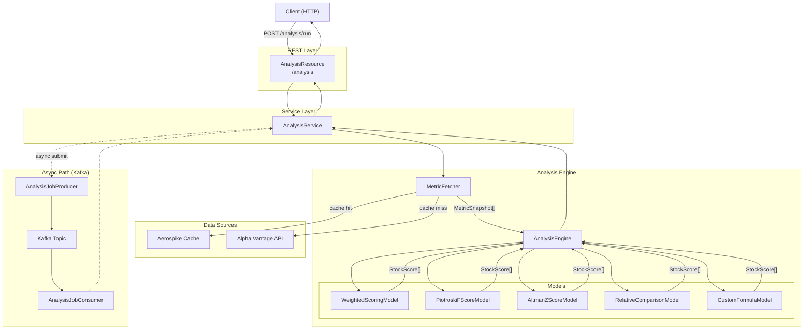
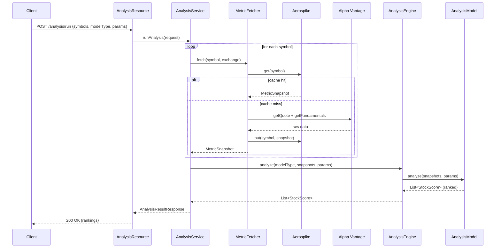
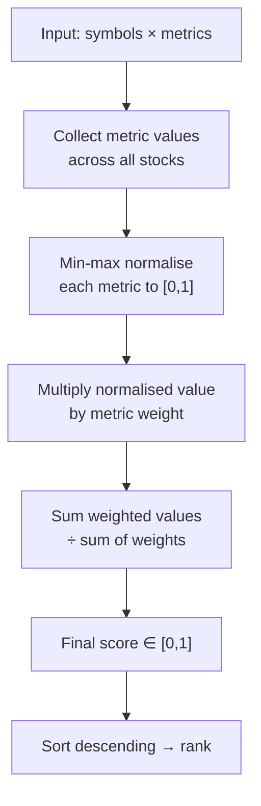
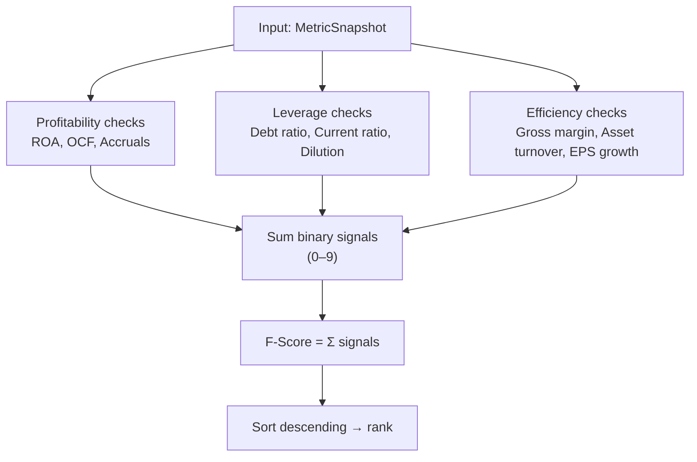
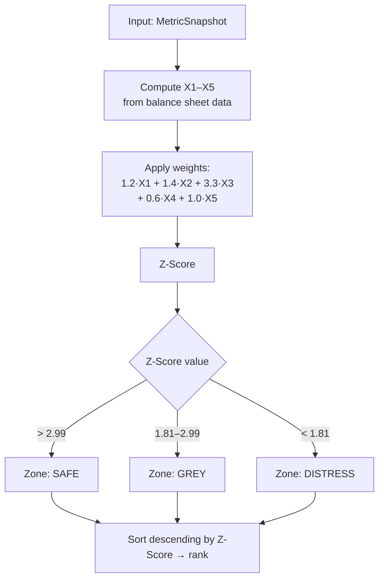
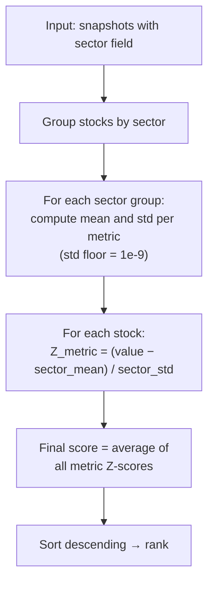
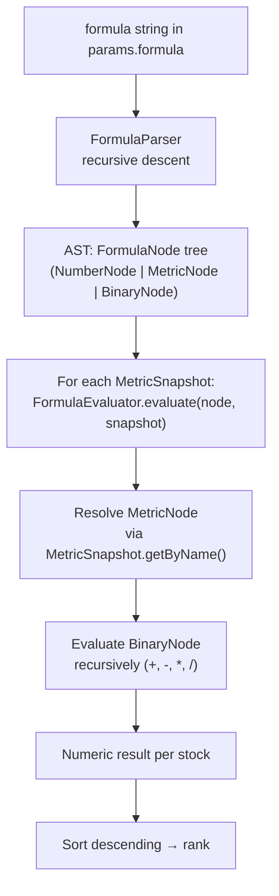
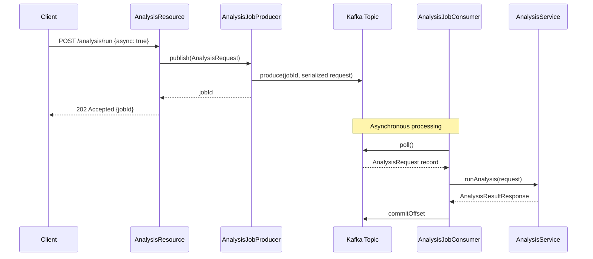

# Analysis API

## 1. Overview

The Analysis API is a multi-model stock ranking engine that scores and ranks a list of stock symbols using financial fundamentals and technical indicators. When a request arrives, the service fetches a `MetricSnapshot` per symbol — first checking an Aerospike cache, falling back to Alpha Vantage if the cache misses — and then dispatches the populated snapshots to one of five analysis models. Each model returns a ranked list of `StockScore` results that include the final score, per-component breakdown, and raw metric values.

Five models are supported, ranging from a general-purpose weighted score to bankruptcy prediction to fully custom user-defined formulas.

---

## 2. API Endpoints

| Method | Path | Description |
|--------|------|-------------|
| `POST` | `/analysis/run` | Run an analysis model synchronously on a list of stocks |
| `GET` | `/analysis/models` | List all available analysis model types |
| `POST` | `/analysis/configs` | Save a named analysis configuration for reuse |
| `GET` | `/analysis/configs/{id}` | Retrieve a previously saved configuration by ID |

### POST /analysis/run

**Request body**

```json
{
  "symbols": ["AAPL", "MSFT", "GOOGL"],
  "exchange": "NASDAQ",
  "modelType": "WEIGHTED_SCORE",
  "params": {
    "weights": {
      "PE": 0.2,
      "EPS_GROWTH": 0.3,
      "ROA": 0.2,
      "CURRENT_RATIO": 0.15,
      "RSI_14": 0.15
    }
  },
  "configId": null
}
```

**Response body**

```json
{
  "modelType": "WEIGHTED_SCORE",
  "computedAtMs": 1741824000000,
  "rankings": [
    {
      "symbol": "MSFT",
      "exchange": "NASDAQ",
      "score": 0.782,
      "rank": 1,
      "breakdown": {
        "PE": 0.156,
        "EPS_GROWTH": 0.234,
        "ROA": 0.160,
        "CURRENT_RATIO": 0.113,
        "RSI_14": 0.119
      },
      "rawMetrics": {
        "PE": 28.4,
        "EPS_GROWTH": 0.18,
        "ROA": 0.19,
        "CURRENT_RATIO": 2.1,
        "RSI_14": 58.3
      }
    }
  ]
}
```

### GET /analysis/models

**Response body**

```json
["WEIGHTED_SCORE", "PIOTROSKI", "ALTMAN_Z", "RELATIVE", "CUSTOM"]
```

### POST /analysis/configs

**Request body**

```json
{
  "userId": "user-123",
  "name": "My Growth Screen",
  "modelType": "WEIGHTED_SCORE",
  "params": {
    "weights": { "EPS_GROWTH": 0.5, "ROA": 0.3, "CURRENT_RATIO": 0.2 }
  }
}
```

**Response body** — returns the saved `AnalysisConfig` with its generated `id`.

### GET /analysis/configs/{id}

Returns the full `AnalysisConfig` for the given `id`.

---

## 3. System Architecture



---

## 4. Synchronous Request Flow



---

## 5. Available Metrics

### Fundamentals

| Metric Name | Field | Description |
|-------------|-------|-------------|
| `PE` | `pe` | Price-to-Earnings ratio |
| `EPS` | `eps` | Earnings per share |
| `EPS_GROWTH` | `epsGrowth` | EPS growth rate (YoY) |
| `REVENUE_GROWTH` | `revenueGrowth` | Revenue growth rate (YoY) |
| `MARKET_CAP` | `marketCap` | Market capitalisation |
| `DIVIDEND_YIELD` | `dividendYield` | Annual dividend yield |
| `DEBT_TO_EQUITY` | `debtToEquity` | Total debt / total equity |
| `CURRENT_RATIO` | `currentRatio` | Current assets / current liabilities |
| `ROA` | `roa` | Return on assets |
| `GROSS_MARGIN` | `grossMargin` | Gross profit / revenue |
| `ASSET_TURNOVER` | `assetTurnover` | Revenue / total assets |
| `RETAINED_EARNINGS` | `retainedEarnings` | Cumulative retained earnings |
| `EBIT` | `ebit` | Earnings before interest and taxes |
| `WORKING_CAPITAL` | `workingCapital` | Current assets − current liabilities |
| `TOTAL_ASSETS` | `totalAssets` | Total assets on balance sheet |
| `TOTAL_LIABILITIES` | `totalLiabilities` | Total liabilities on balance sheet |
| `OPERATING_CASH_FLOW` | `operatingCashFlow` | Cash generated from operations |
| `SHARES_OUTSTANDING` | `sharesOutstanding` | Total shares outstanding |
| `HIGH_52W` | `high52w` | 52-week price high |
| `LOW_52W` | `low52w` | 52-week price low |

### Technicals

| Metric Name | Field | Description |
|-------------|-------|-------------|
| `RSI_14` | `rsi14` | 14-period Relative Strength Index |
| `MACD_VALUE` | `macdValue` | MACD line value |
| `MACD_SIGNAL` | `macdSignal` | MACD signal line |
| `MACD_HISTOGRAM` | `macdHistogram` | MACD histogram (value − signal) |
| `SMA_20` | `sma20` | 20-period simple moving average |
| `SMA_50` | `sma50` | 50-period simple moving average |
| `SMA_200` | `sma200` | 200-period simple moving average |
| `CURRENT_PRICE` | `currentPrice` | Latest closing price |
| `VOLUME` | `volume` | Most recent trading volume |
| `AVG_VOLUME` | `avgVolume` | Average trading volume |

Metric names are resolved at runtime via `MetricSnapshot.getByName(String name)`.

---

## 6. Analysis Models

### 6.1 WEIGHTED_SCORE

**What it does**

Min-max normalises each metric across all input stocks to a [0, 1] range, then computes a weighted average score. Higher is better for all metrics (PE is inverted internally so a lower PE maps to a higher normalised value).

**Default weights**

| Metric | Weight |
|--------|--------|
| `PE` | 0.20 |
| `EPS_GROWTH` | 0.30 |
| `ROA` | 0.20 |
| `CURRENT_RATIO` | 0.15 |
| `RSI_14` | 0.15 |

Custom weights are passed via `params.weights` in the request.

**Scoring flow**



**When to use**: General-purpose ranking when you want a balanced view across valuation (PE), growth (EPS_GROWTH), profitability (ROA), safety (CURRENT_RATIO), and momentum (RSI_14).

---

### 6.2 PIOTROSKI F-SCORE

**What it does**

Assigns 9 binary signals (0 or 1) across three groups. The F-Score is the sum of all signals (0–9). Higher scores indicate financially stronger, improving companies.

**Signal table**

| Group | Signal | Condition | Points |
|-------|--------|-----------|--------|
| Profitability | `ROA_POSITIVE` | `roa > 0` | 1 |
| Profitability | `OCF_POSITIVE` | `operatingCashFlow > 0` | 1 |
| Profitability | `ACCRUALS_NEGATIVE` | `operatingCashFlow / totalAssets > roa` | 1 |
| Leverage | `DEBT_RATIO_DECREASED` | `debtToEquity < 0.5` | 1 |
| Leverage | `CURRENT_RATIO_INCREASED` | `currentRatio > 1.0` | 1 |
| Leverage | `NO_NEW_SHARES` | `epsGrowth >= 0` (proxy for no dilution) | 1 |
| Efficiency | `GROSS_MARGIN_POSITIVE` | `grossMargin > 0` | 1 |
| Efficiency | `ASSET_TURNOVER_POSITIVE` | `assetTurnover > 0` | 1 |
| Efficiency | `EPS_GROWTH_POSITIVE` | `epsGrowth > 0` | 1 |

**Scoring flow**



**Interpretation**

| F-Score | Signal |
|---------|--------|
| 7 – 9 | Strong buy — financially healthy and improving |
| 3 – 6 | Neutral — mixed signals |
| 0 – 2 | Avoid — weak fundamentals |

**When to use**: Identifying financially strong or improving value stocks. Particularly effective when combined with a low-PE or low-PB screen to filter out value traps.

---

### 6.3 ALTMAN Z-SCORE

**What it does**

Predicts the probability of corporate financial distress using five weighted financial ratios. Originally designed for manufacturing companies, it remains a widely used solvency screen.

**Formula**

```
Z = 1.2·X1 + 1.4·X2 + 3.3·X3 + 0.6·X4 + 1.0·X5
```

| Component | Formula | Description |
|-----------|---------|-------------|
| X1 | `workingCapital / totalAssets` | Liquidity relative to asset base |
| X2 | `retainedEarnings / totalAssets` | Cumulative profitability / leverage |
| X3 | `ebit / totalAssets` | Operating efficiency |
| X4 | `marketCap / totalLiabilities` | Solvency cushion |
| X5 | `revenueGrowth` | Asset efficiency (revenue growth proxy) |

**Zone classification**

| Z-Score | Zone | Interpretation |
|---------|------|---------------|
| > 2.99 | `SAFE` | Low distress risk |
| 1.81 – 2.99 | `GREY` | Caution — elevated risk |
| < 1.81 | `DISTRESS` | High bankruptcy risk |

**Scoring flow**



**When to use**: Risk management and negative screening — filter out companies in the DISTRESS zone before applying other ranking models.

---

### 6.4 RELATIVE COMPARISON

**What it does**

Groups input stocks by sector and computes a Z-score for each stock relative to its sector peers on each metric. This eliminates macro-level biases (e.g., technology stocks naturally have higher PE ratios than utilities) and highlights which stocks are genuinely strong within their competitive context.

**Default metrics**

`PE`, `EPS_GROWTH`, `ROA`, `DEBT_TO_EQUITY`, `CURRENT_RATIO`, `GROSS_MARGIN`

**Scoring flow**



**When to use**: Intra-sector comparison — e.g., ranking all semiconductor stocks against each other, or all bank stocks. Not suitable when comparing across sectors.

---

### 6.5 CUSTOM FORMULA

**What it does**

Evaluates a user-defined arithmetic expression using any metric name as a variable. The formula is parsed into an AST and evaluated independently for each stock. Stocks are ranked by the resulting numeric value, descending.

**Formula syntax**

| Element | Examples |
|---------|---------|
| Metric name | `PE`, `EPS_GROWTH`, `RSI_14`, `GROSS_MARGIN` |
| Numeric literal | `2.5`, `0.1`, `100` |
| Operators | `+`, `-`, `*`, `/` |
| Grouping | `(EPS_GROWTH * ROA) / PE` |

**Formula grammar (EBNF)**

```
expr    = term { ('+' | '-') term } ;
term    = factor { ('*' | '/') factor } ;
factor  = NUMBER
        | METRIC_NAME
        | '(' expr ')' ;

METRIC_NAME = [A-Z][A-Z0-9_]* ;
NUMBER      = [0-9]+ ('.' [0-9]+)? ;
```

**Evaluation flow**



**Example formulas**

```
EPS_GROWTH * ROA / PE
(GROSS_MARGIN - DEBT_TO_EQUITY) * CURRENT_RATIO
(EBIT / TOTAL_ASSETS) * 3.3 + (WORKING_CAPITAL / TOTAL_ASSETS) * 1.2
```

Division by zero is handled gracefully — the evaluator returns 0.0 in that case.

**When to use**: Power users with a custom scoring hypothesis or replicating a proprietary screen. The formula is also the building block for saved configurations that encode a team's investment thesis.

---

## 7. Async Analysis Flow (Kafka)

For long-running or batch jobs, the analysis request can be submitted asynchronously via Kafka rather than waiting for the HTTP response.



`AnalysisJobConsumer` implements the Dropwizard `Managed` lifecycle — it starts polling on application startup and shuts down cleanly when the service stops.

---

## 8. Saving & Reusing Configurations

Named configurations allow users to persist a `modelType + params` bundle and reference it by ID in future requests.

**Save a configuration**

```http
POST /analysis/configs
Content-Type: application/json

{
  "userId": "user-123",
  "name": "Value + Quality Screen",
  "modelType": "WEIGHTED_SCORE",
  "params": {
    "weights": {
      "PE": 0.25,
      "EPS_GROWTH": 0.25,
      "ROA": 0.25,
      "CURRENT_RATIO": 0.25
    }
  }
}
```

**Response** — includes the generated `id` (e.g., `"cfg-9f3a2b"`).

**Run with saved config**

```json
{
  "symbols": ["AAPL", "AMZN"],
  "exchange": "NASDAQ",
  "modelType": "WEIGHTED_SCORE",
  "configId": "cfg-9f3a2b"
}
```

When `configId` is present, `AnalysisService` retrieves the stored `AnalysisConfig`, deserialises `paramsJson`, and merges the params into the request before dispatching to the engine.

**Retrieve a config**

```http
GET /analysis/configs/cfg-9f3a2b
```

---

## 9. Model Comparison

| Model | Required Inputs | Output | Best For | Complexity |
|-------|----------------|--------|----------|-----------|
| `WEIGHTED_SCORE` | Any metrics + weights | Score ∈ [0, 1] | General multi-factor ranking | Low |
| `PIOTROSKI` | ROA, OCF, D/E, CR, GM, AT, EPS_GROWTH | Integer 0–9 | Value stock quality filter | Low |
| `ALTMAN_Z` | WC, RE, EBIT, MC, TL, TA, REV_GROWTH | Z-Score + zone label | Bankruptcy / distress screen | Low |
| `RELATIVE` | Sector + any metrics | Z-Score (mean 0) | Within-sector comparison | Medium |
| `CUSTOM` | Any metrics referenced in formula | Arbitrary numeric | Custom hypothesis / research | Medium–High |

---

## 10. Full Request/Response Examples

### PIOTROSKI

```json
// Request
{
  "symbols": ["JNJ", "PFE", "MRK"],
  "exchange": "NYSE",
  "modelType": "PIOTROSKI",
  "params": {}
}

// Response
{
  "modelType": "PIOTROSKI",
  "computedAtMs": 1741824000000,
  "rankings": [
    {
      "symbol": "JNJ",
      "exchange": "NYSE",
      "score": 8.0,
      "rank": 1,
      "breakdown": {
        "ROA_POSITIVE": 1.0,
        "OCF_POSITIVE": 1.0,
        "ACCRUALS_NEGATIVE": 1.0,
        "DEBT_RATIO_DECREASED": 1.0,
        "CURRENT_RATIO_INCREASED": 1.0,
        "NO_NEW_SHARES": 1.0,
        "GROSS_MARGIN_POSITIVE": 1.0,
        "ASSET_TURNOVER_POSITIVE": 1.0,
        "EPS_GROWTH_POSITIVE": 0.0
      },
      "rawMetrics": {
        "ROA": 0.12, "OPERATING_CASH_FLOW": 18500000000,
        "DEBT_TO_EQUITY": 0.42, "CURRENT_RATIO": 1.8,
        "GROSS_MARGIN": 0.67, "ASSET_TURNOVER": 0.55, "EPS_GROWTH": -0.02
      }
    }
  ]
}
```

### ALTMAN_Z

```json
// Request
{
  "symbols": ["F", "GM", "TSLA"],
  "exchange": "NYSE",
  "modelType": "ALTMAN_Z",
  "params": {}
}

// Response (excerpt)
{
  "modelType": "ALTMAN_Z",
  "computedAtMs": 1741824000000,
  "rankings": [
    {
      "symbol": "TSLA",
      "score": 3.42,
      "rank": 1,
      "breakdown": {
        "X1_WORKING_CAPITAL": 0.312,
        "X2_RETAINED_EARNINGS": 0.561,
        "X3_EBIT": 0.842,
        "X4_MARKET_CAP": 1.521,
        "X5_REVENUE_GROWTH": 0.184,
        "ZONE": 0.0
      }
    }
  ]
}
```

### RELATIVE

```json
// Request
{
  "symbols": ["NVDA", "AMD", "INTC", "QCOM"],
  "exchange": "NASDAQ",
  "modelType": "RELATIVE",
  "params": {}
}

// Response (excerpt — all in same sector, Z-scores sum to ~0)
{
  "modelType": "RELATIVE",
  "computedAtMs": 1741824000000,
  "rankings": [
    {
      "symbol": "NVDA",
      "score": 1.84,
      "rank": 1,
      "breakdown": {
        "PE": -0.21,
        "EPS_GROWTH": 2.10,
        "ROA": 1.92,
        "DEBT_TO_EQUITY": 0.45,
        "CURRENT_RATIO": 0.88,
        "GROSS_MARGIN": 1.83
      }
    }
  ]
}
```

### CUSTOM

```json
// Request
{
  "symbols": ["AAPL", "MSFT", "META"],
  "exchange": "NASDAQ",
  "modelType": "CUSTOM",
  "params": {
    "formula": "EPS_GROWTH * ROA / PE"
  }
}

// Response (excerpt)
{
  "modelType": "CUSTOM",
  "computedAtMs": 1741824000000,
  "rankings": [
    {
      "symbol": "MSFT",
      "score": 0.00127,
      "rank": 1,
      "breakdown": {
        "formula_result": 0.00127
      },
      "rawMetrics": {
        "EPS_GROWTH": 0.18, "ROA": 0.19, "PE": 26.9
      }
    }
  ]
}
```
